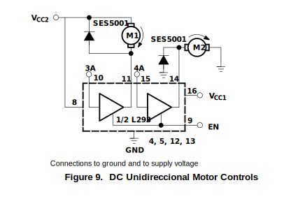

# Robot_Futbolista
Robot que juega futbol, y va a competir en Torneo de robótica USCOTRON
# Requisitos
- Tracción: Libre.
- Dimensiones máximas: 15 x 15 x 15 cm.
- Materiales y diseño: Libre.
- Indicador de encendido: Obligatorio.
- Peso máximo: 750 gramos. Sin tolerancia.
- Alimentación: Debe ser por baterías;
- Resistencia: Las partes en contacto con otros robots deben ser resistentes para evitar roturas.
- Restricciones: Prohibido el uso de sistemas de disparo, agarre, pateo, grippers, materiales pegajosos, solenoides, o cualquier sistema que empuje o agarre la pelota.

- Control: Radiofrecuencia (RF) o Bluetooth.
- Distancia mínima: 3 metros.
- Frecuencias múltiples: Evitar - interferencias; disponer de una alternativa.

## Características de Hardware
### ESP32

### MOTORES DC
Name: TT motor
Color: Black
Type: 1:120
Features: Strong magnetic,Anti-interference
Model: 1A120-1812L(Prefer Torque)
Rated voltage: 3V/6V
Current: ≤180mA/≤250mA
Speed: 45±10%r/min  90±10%r/min
Torque: 0.45±10%kgf.cm 0.85±10%kgf.cm

### Driver 4 Motores DC (3v3 o 5v)
Motor Shield Driver L293D

### Baterias

## Características de Software
  - ESP32 SDK Arduino (PlatformIO)
  - Android Studio (Java)

## Control del Robot 
- **Control Manual**
  - [x] Aplicación android (Bluetooth).
  - [ ] joystick (Investigar).
  - [ ] Aplicación web.
  - [ ] RF control a distancia.

- **Control Semiautomático** **Hard**
  Implementación avanzada que pueda ayudar al robot a reaccionar parcialmente de forma autónoma, asistiendo al operador en el juego.
- **Control Automático**
  Uso de **Machine Learning** (propuesta en evaluación, es una meta de alta complejidad) para desarrollar un control completamente autónomo del robot.

### Etapa de Alimentación
Uso de baterías, ya sea recargables o de un solo uso:
- Baterias de litio 18650
- Baterias alcalinas
- Baterias de 9V
- regulador para 3.3V (esp32)
- Regulador para (9.0V/5V) (Driver L293)

En esta etapa es necesario regular el voltage de las baterias 18650
Para el modulo de carga se necesita lo siguiente:
#### Alternativas al DMP1045U P-Channel (1x)
- Ao3401a smd
- MOSFET Canal P 30V 2A
#### Alternativas al SB220 2A (2x)
- Diodo Schottky 
- SSA210
- FR207
- SS36
- SR5150
- SR260 SB260
#### 3.3V Regulator ESP32 (500mA)
- SMD LD1117
- DC/DC boost buck Converter **MT3608** 6W 2A
#### 5-9V Regulator Motors (2A)
- DC/DC boost buck Converter **MT3608** 6W 2A

### Etapa de Control de Motores
Para controllar los motores se va a utilizar Driver **L293D** Puente H Pap Dc, El punete H se encarga de controlar el sentido de giro de los motores ()

| Controlador | Tipo                                                 | Voltaje Operativo | Corriente Máxima (por canal) |     |
| ----------- | ---------------------------------------------------- | ----------------- | ---------------------------- | --- |
| **L298N**   | Dual H Bridge DC Motor Driver                        | 5 - 46 V          | 2 A                          |     |
| **DRV8833** | two H-bridge drivers                                 | 2.7 - 10.8 V      | 1.5 A                        |     |
| **DRV8825** | has two H-bridge drivers and a microstepping indexer | 8.2 - 45 V        | 2.5 A                        |     |
| **L6205**   | DMOS Dual Full Bridge                                | 8 - 52 V          | 2.8 A                        |     |
| **L923**    | quadruple high-current half-H drivers                | 4.5 V - 36 V      | 1A                           |     |

**Controladores para 4 Motores DC**
Se va a utilizar Motor Shield Driver **L293D** Puente H Pap Dc Servo Arduino **L293**
Aquí tienes una tabla con las características principales del **módulo L293**:

| **Características**               | **Descripción**                                                                                                                                                    |
|-----------------------------------|--------------------------------------------------------------------------------------------------------------------------------------------------------------------|
| **Tipo de módulo**                | Controlador de motor de puente H                                                                                                                                    |
| **Número de canales**             | 2 (doble puente H)                                                                                                                                                |
| **Voltaje de operación**          | 4.5V a 36V                                                                                                                                                         |
| **Corriente máxima de salida**    | Hasta 600 mA por canal (pico de 1.2A en corto tiempo)                                                                                                              |
| **Voltaje lógico**                | 5V                                                                                                                                                                |
| **Modo de operación**             | Control de motores en ambas direcciones (bidireccional)                                                                                                            |
| **Temperatura de operación**      | -40°C a 150°C                                                                                                                                                      |
| **Dimensiones:**| **6.8cm x 5.5cm x 2cm** |

Info https://electronilab.co/tienda/shield-l293d-puente-h-para-motores-dc-servos/
The **L293** accept standard DTL or TTL logic levels and drive inductive loads 

El Cotrolador permite varias formas de controlar los motores DC, Hay dos formas de hacerlo, Unidireccional y Bidireccional.

#### Unidireccional

**Tabla 1: Control Unidireccional del Motor DC**

| EN | 3A | M1       | 4A       | M2                     |
|----|----|----------|----------|------------------------|
| H  | H  | Parada rápida del motor | H | Correr                  |
| H  | L  | Correr   | L        | Parada rápida del motor |
| L  | X  | Parada libre del motor  | X | Parada libre del motor |

#### Bidireccional

**Tabla 2: Control Bidireccional del Motor DC**

| EN | 1A | 2A | Función              |
|----|----|----|----------------------|
| H  | L  | H  | Girar a la derecha   |
| H  | H  | L  | Girar a la izquierda |
| H  | L  | L  | Parada rápida del motor |
| H  | H  | H  | Parada rápida del motor |
| L  | X  | X  | Parada libre del motor  |
